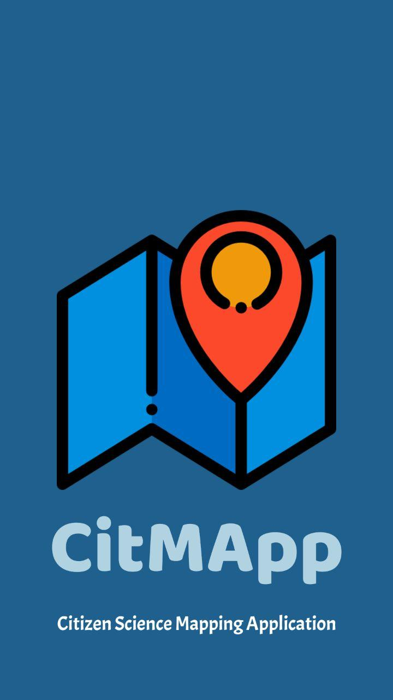
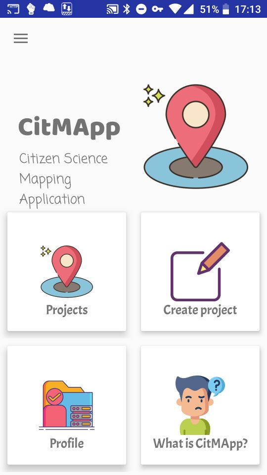
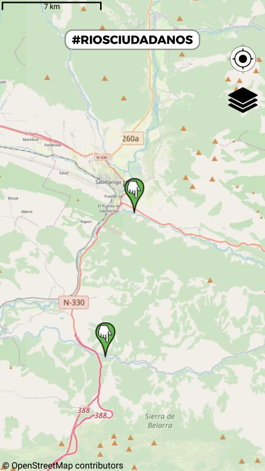
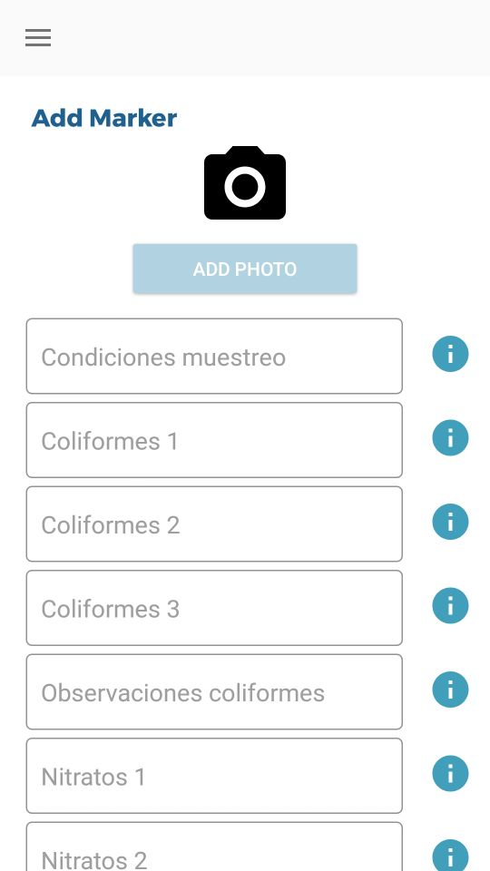

# CitMApp - *Citizen science Mapping Application*
   

[See below for English description](#description)

## Descripción

CitMApp, es una plataforma de proyectos de mapeado colaborativo que tiene como objetivo visibilizar el día a día de la ciencia ciudadana en nuestros pueblos, ciudades y nuestro entorno más cercano.

La aplicación permite la recogida de datos en tiempo real y favorece la puesta en marcha de análisis científicos sobre biodiversidad, urbanismo, conservación del patrimonio, contaminación ambiental, lumínica…
Los usuarios recogen la posición y actividad, realizan mediciones o captan imágenes relevantes de fenómenos de su interés que podrán ser ampliados por la comunidad.

El usuario de CitMApp puede convertirse en gestor de su propio proyecto de ciencia ciudadana, colaborar en proyectos existentes o valorarlos para que otros ciudadanos puedan encontrarlos con facilidad.
Como gestor de proyecto, el usuario define los parámetros que considera útiles para el estudio, y que usarán el resto de científicos ciudadanos para añadir más información al proyecto.

La aplicación está desarrollada por la Fundación Ibercivis, promovida por el Grupo Residente Mapeado Colaborativo de Zaragoza Activa / Geoinquietos Zaragoza y financiada por el ayuntamiento de Zaragoza a través de Zaragoza Activa.

La aplicación CitMApp utiliza como mapa base de los mapas planteados la librería OSMdroid (https://github.com/osmdroid/osmdroid) y también hace uso del OSMBonusPack (https://github.com/MKergall/osmbonuspack). Además, para la visualización de imágenes on-line utiliza la librería Picasso (https://github.com/square/picasso) y para los HTTP Request emplea la librería Volley (https://github.com/google/volley).
Algunos de los iconos utilizados en las pantallas de CitMApp provienen de FlatIcon (https://www.flaticon.es/)

Para cualquier duda o sugerencia puedes [abrir un issue](https://github.com/Ibercivis/CitMApp/issues) en este repositorio o contactar con info@ibercivis.es

## Description

CitMApp, is a collaborative mapping project platform that aims to make visible the daily life of citizen science in our towns, cities and our closest environment.

The application allows the collection of data in real time and favors the implementation of scientific analyzes on biodiversity, urban planning, heritage conservation, environmental pollution, light ... Users collect the position and activity, make measurements or capture relevant images of phenomena of Your interest may be extended by the community.

The CitMApp user can become a manager of their own citizen science project, collaborate on existing projects or value them so that other citizens can find them easily. As a project manager, the user defines the parameters that he considers useful for the study, and that the rest of citizen scientists will use to add more information to the project.

The application is developed by the Ibercivis Foundation, promoted by the Zaragoza Activa / Geoinquietos Zaragoza Collaborative Mapped Resident Group and financed by the Zaragoza City Council through Zaragoza Activa.

The CitMApp application uses the OSMdroid library as a base map (https://github.com/osmdroid/osmdroid) and also uses the OSMBonusPack (https://github.com/MKergall/osmbonuspack). In addition, for the visualization of images online, it uses the Picasso library (https://github.com/square/picasso) and for the HTTP Request it uses the Volley library (https://github.com/google/volley). Some of the icons used on CitMApp screens come from FlatIcon (https://www.flaticon.es/)

For any questions or suggestions you can [open an issue here](https://github.com/Ibercivis/CitMApp/issues) or contact to info@ibercivis.es

